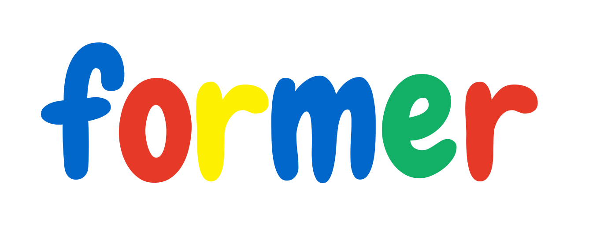

<div align="center">

  <div style="text-align:center;">
    
  </div>

  <p>👻 Amazing form adapter, write less, do much.</p>
</div>

<hr />

[![Build Status][build-badge]][build]
[![codecov][codecov-badge]][codecov]
[![Codacy Badge][code-quality-badge]][code-quality]
[![version][version-badge]][package]
[![size][size-badge]][package]
[![downloads][downloads-badge]][package]
[![PRs Welcome][prs-badge]][prs]

## Feature

Former provides an adapter for the mainstream UI library `form` components and the ability from `JSON schema` to `Vue` view.

## Install

This module is distributed via [npm][npm] which is bundled with [node][node] and
should be installed as one of your project's `dependencies`:

```bash
$ npm install --save @xizhouh/formler
```

## Quick Start

```js
import Vue from 'vue';
import Former from '@xizhouh/former';
import Element from 'element-ui';
import 'element-ui/lib/theme-chalk/index.css';

Vue.use(Element);
Vue.component('Former', Former);
```

For more information like adapting other UI librarys, please refer to [Quick Start][document-quick-start] in our documentation.

## Browser Support

Modern browsers and Internet Explorer 10+.

## License

WTFPL

[npm]: https://www.npmjs.com/
[node]: https://nodejs.org
[build-badge]: https://img.shields.io/travis/HuangXiZhou/former.svg?style=flat-square
[build]: https://travis-ci.org/HuangXiZhou/former
[codecov-badge]: https://img.shields.io/codecov/c/gh/HuangXiZhou/former.svg?style=flat-square
[codecov]: https://codecov.io/gh/HuangXiZhou/former
[code-quality-badge]: https://img.shields.io/codacy/grade/4653fb27e45e46de94e94364d53cdeef.svg?style=flat-square
[code-quality]: https://www.codacy.com/app/HuangXiZhou/former
[version-badge]: https://img.shields.io/npm/v/@xizhouh/former.svg?style=flat-square
[size-badge]: https://img.shields.io/bundlephobia/minzip/@xizhouh/former.svg?style=flat-square
[package]: https://www.npmjs.com/package/@xizhouh/former
[downloads-badge]: https://img.shields.io/npm/dm/@xizhouh/former.svg?style=flat-square
[prs-badge]: https://img.shields.io/badge/PRs-welcome-brightgreen.svg?style=flat-square
[prs]: https://github.com/HuangXiZhou/former/pulls
[document-quick-start]: https://huangxizhou.github.io/former/intro/quickStart.html
